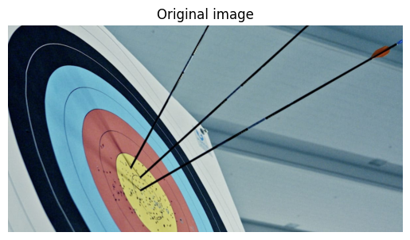
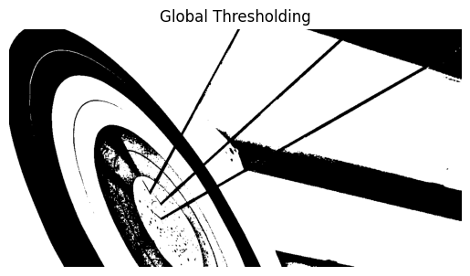
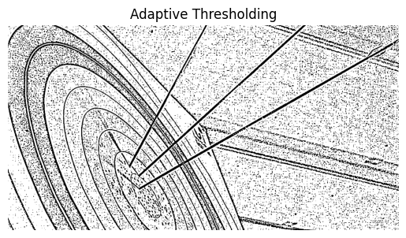
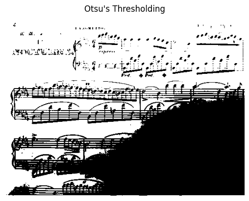

# Thresholding using python and OpenCV

## Aim
To segment the image using global thresholding, adaptive thresholding and Otsu's thresholding using python and OpenCV.

## Software Required
1. Anaconda - Python 3.7
2. OpenCV

## Algorithm

### Step1:
Load the necessary packages.

### Step2:
Read the Image and convert to grayscale.

### Step3:
Use Global thresholding to segment the image.

### Step4:
Use Adaptive thresholding to segment the image.

### Step5:
Use Otsu's method to segment the image and display the results.

## Program

```

Developed By :  Krishna Prasad S
Register No. :  212223230108

```

```python

# Load the necessary packages

import cv2
import numpy as np
import matplotlib.pyplot as plt


# Read the Image and convert to grayscale

image = cv2.imread("archery1.jpg")
gray = cv2.cvtColor(image, cv2.COLOR_BGR2GRAY)

plt.imshow(cv2.cvtColor(image, cv2.COLOR_BGR2RGB))
plt.title("Original image")
plt.axis("off")


# Use Global thresholding to segment the image

__, global_threshold = cv2.threshold(gray, 127, 255, cv2.THRESH_BINARY)

plt.imshow(global_threshold, cmap = "gray")
plt.title("Global Thresholding")
plt.axis("off")


# Use Adaptive thresholding to segment the image

adaptive_threshold = cv2.adaptiveThreshold(gray, 255, cv2.ADAPTIVE_THRESH_GAUSSIAN_C, cv2.THRESH_BINARY, 11, 2)

plt.imshow(adaptive_threshold, cmap = "gray")
plt.title("Adaptive Thresholding")
plt.axis("off")


# Use Otsu's method to segment the image 

__, otsu_threshold = cv2.threshold(gray, 0, 255, cv2.THRESH_BINARY + cv2.THRESH_OTSU)

plt.imshow(otsu_threshold, cmap = "gray")
plt.title("Otsu's Thresholding")
plt.axis("off")

```
## Output

### Original Image


### Global Thresholding


### Adaptive Thresholding


### Optimum Global Thesholding using Otsu's Method



## Result
Thus the images are segmented using global thresholding, adaptive thresholding and optimum global thresholding using python and OpenCV.
